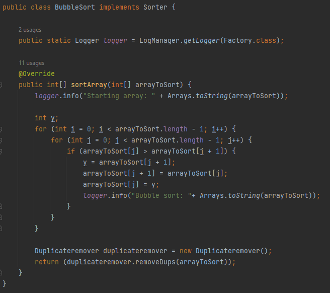

# SortManager

The sort manager program has three different ways of sorting through an array of random numbers and returning said array 
ordered from smallest to largest number. The user can choose the size of the array, it is then filled randomly, and the 
user can choose which method of sorting to use. the user is also able to choose to compare how long each method takes to 
sort through an array.
## Interface

This interface serves as the blueprint for all three sorting methods.

## Bubble Sort

The bubble sort uses a nested for loop to select each elemnt in an array and then compare that element to all others in the array to sort them in order.
The sorter then uses the Duplicate remover class to remove any duplicate values.

## Merge Sort

The merge sort class is made of two methods. The first method splits the array into smaller arrays until each array only has one element. It then calls the second method recursively.

The second method will then join these array back together, placing smaller ints before larger ones.

In case one of the arrays has more elements than the other this section of code will go through the remainder of that array.

## Binary sort
The binary sorting method currently doesn't work.

## Main Test

The Bubble sort class has been tested for when there are an odd number of elements in the array and for if the array is empty.

The Bubble sort class was also tested with large numbers to see if that would affect it.
The Merge sort, unlike the bubble sort, when passed an empty array will return a null array.

When passed an array containing only 2 elements the Merge sort was able to order them.

## Duplicate Remover

The duplicate remover class makes a copy of the array passed to it as a linked hash set, since set can not hold duplicates all duplicates are removed.
Then a copy of the set is made in an array and this is returned.

## Factory

The factory class has a method for calling each of the different sorting methods

The class also has a method for comparing the time it takes for each sorting method to finish.

## View manager

The view manager gives the user their options and takes in the user's input, which consists of what type of array to use and the length of the random array that will be passed to it.

Using switch cases the method will call whichever sorting method the user specifies.

The user is also given the choice to compare the time each sorting method takes. There is a default case for if the user types in an intiger that isn't between 1 and 4.

Finally the user is asked if the want to continue or stop.

## Main

The main class runs the options method from the view manager class.

## Running
The following is an example of the code running

